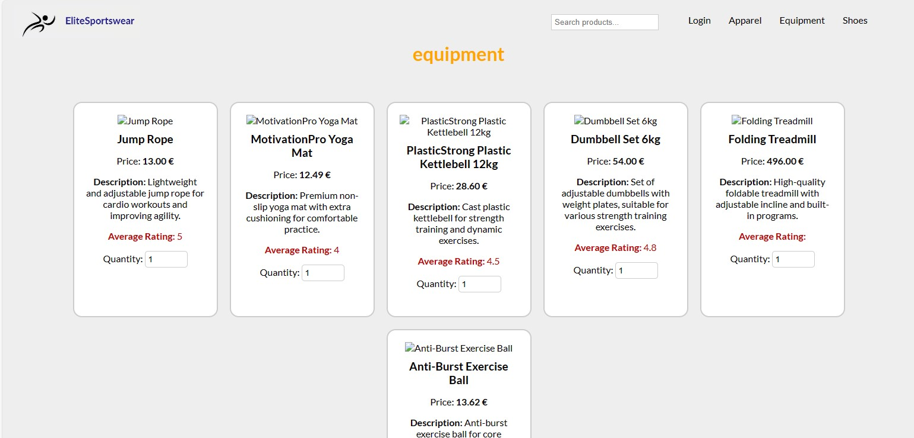
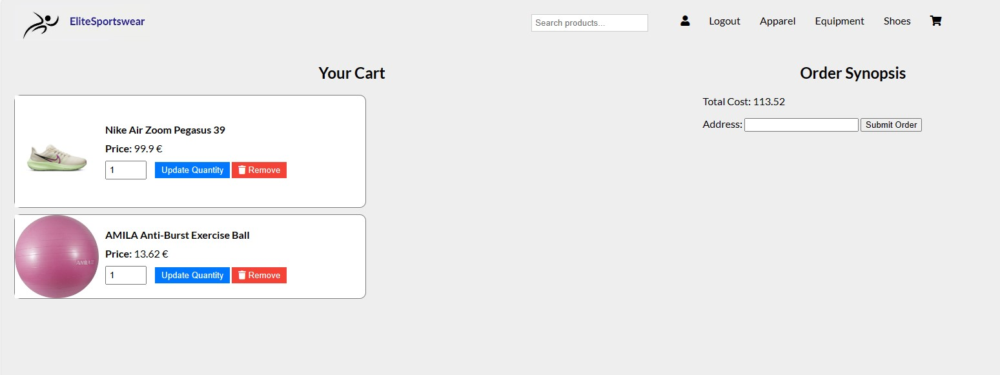
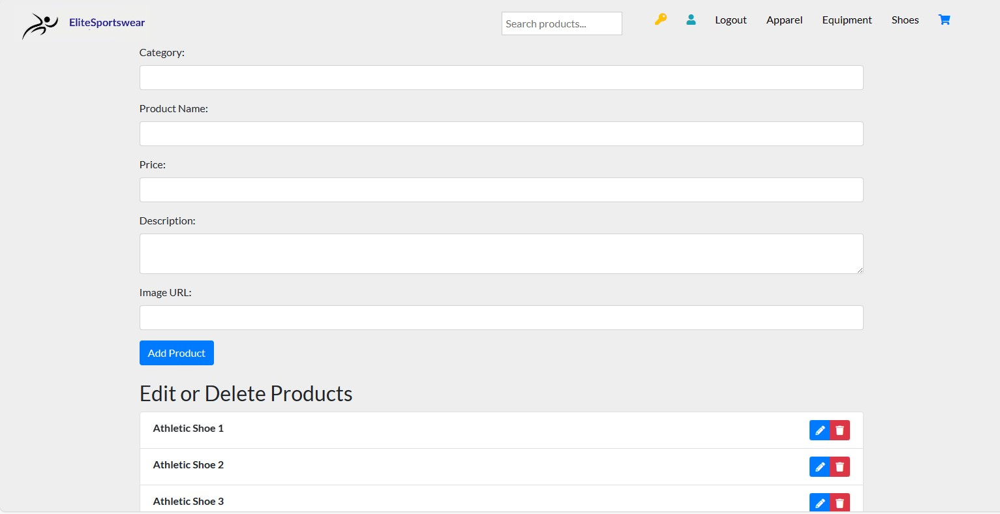

# Athletics eShop Web Application

## Table of Contents
- [Overview](#overview)
- [Features](#features)
- [Tech Stack](#tech-stack)
- [Screenshots](#screenshots)
- [Getting Started](#getting-started)
  - [Prerequisites](#prerequisites)
  - [Installation](#installation)
  - [Database Import](#database-import)
- [Credentials](#Credentials)

## Overview

The Athletics eShop is a web-based e-commerce application developed to provide a platform for customers to perform CRUD operations. This project was created as a part of my university coursework.

## Features

- **User Authentication:** Users can create accounts, log in, and manage their profiles.
- **Product Catalog:** Browse for a wide range of athletic products.
- **Shopping Cart:** Add products to the cart, update quantities, and proceed to checkout.
- **Order Management:** Users can view their order history and track the status of their orders.
- **Admin Panel:** Administrators can add, edit, or remove products.
- **Responsive Design:** The application is designed to be user-friendly on both desktop and mobile devices.

## Tech Stack

- **Front-end:** HTML, CSS, JavaScript
- **Back-end:** Node.js, Express.js
- **Database:** MySQL

## Screenshots

Here are some screenshots from the Athletics eShop application:

### Product Catalog

---

### Shopping Cart

---

### Administrator Panel

## Getting Started

### Prequisites

- [Node.js](https://nodejs.org/) (version 18.17.1)
- [MySQL](https://www.mysql.com/) 

### Installation

1. Clone the repository to your local machine:
  git clone https://github.com/MelinaMoraiti/Athletics-eShop.git

2. Navigate to the project directory:
  cd Athletics-eShop
3. Install project dependencies:
  npm install

### Database Import
To set up the project's database, follow these steps:

Create a Database:

Use MySQL Workbench or any MySQL client to create an empty database for the project.

#### Database Configuration:

If you want to change database and use your own.In the project directory, locate the public/scripts/db.js file and update the database connection information (e.g., database name, username, password).

host=localhost
user=your_username
password=your_password
database=your_database_name

#### Import Database:

Locate the database backup file in the project directory Database/backup_file.sql.

Use MySQL Workbench or the command line to import the database into your MySQL server.
mysql -u root -p sports_eshop < database.sql

## Credentials

The "database script" populates some users on DB with different roles their passwords are securely hashed with bcrypt before being stored in the database. Use the following examples:

- Regular user
  
**email:** user@email.com
**password:** user123

- Admin
  
**email:** admin@admin.com
**password:** admin12345

Thank you for exploring the Athletics eShop web application. If you have any questions, feedback, or suggestions, please feel free to contact me at [melinamoraith@gmail.com.com].
