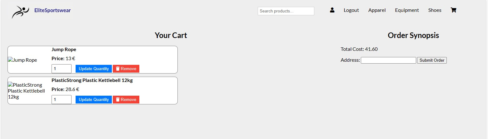

# Athletics eShop Web Application

## Table of Contents
- [Overview](#overview)
- [Features](#features)
- [Tech Stack](#tech-stack)
- [Screenshots](#screenshots)
- [Getting Started](#getting-started)
  - [Prerequisites](#prerequisites)
  - [Installation](#installation)
  - [Configuring .env](#configuring-.env)
  - [Database Import](#database-import)
  - [Running the Application](#running-the-application)
- [Credentials](#Credentials)

## Overview

The Athletics eShop is a web-based e-commerce application developed to provide a platform for customers to perform CRUD operations. This project was created as a part of my university coursework.

## Features

- **User Authentication:** Users can create accounts, log in, and manage their profiles.
- **Product Catalog:** Browse and search for a wide range of athletic products.
- **Shopping Cart:** Add products to the cart, update quantities, and proceed to checkout.
- **Order Management:** Users can view their order history and track the status of their orders.
- **Admin Panel:** Administrators can add, edit, or remove products, manage orders, and oversee user accounts.
- **Responsive Design:** The application is designed to be user-friendly on both desktop and mobile devices.

## Tech Stack

- **Front-end:** HTML, CSS, JavaScript
- **Back-end:** Node.js, Express.js
- **Database:** MySQL

## Screenshots

Here are some screenshots from the Athletics eShop application:

### Product Catalog


---

### Shopping Cart



---

### Administrator Panel


## Getting Started

### Prequisites

- [Node.js](https://nodejs.org/) (version 18.17.1)
- [MySQL](https://www.mysql.com/) 

### Installation

1. **Clone the repository to your local machine:**
  ```bash
  git clone https://github.com/MelinaMoraiti/Athletics-eShop.git
```

2. **Navigate to the project directory:**
  ```bash
  cd "Athletics-eShop"
```
3. **Install project dependencies:**
  ```bash
  npm install
```
4. **Create a .env file in the root directory of the project:**
  ```bash
  touch .env
```

#### Configuring .env

Open the .env file using a text editor and add the following variables to connect as a test user to the database.
``` bash
DB_HOST=localhost
DB_USER=test_user
DB_PASSWORD=test_password
DB_DATABASE=sports_eshop
PORT=3000
DB_CONNECTION_LIMIT=10
```
- DB_HOST: The hostname or IP address of your database server.
- DB_USER: The username for your database.
- DB_PASSWORD: The password for your database.
- DB_DATABASE: The name of the database you want to connect to.
- PORT: The port on which your server will run (if applicable).
- DB_CONNECTION_LIMIT: The maximum number of database connections (adjust as needed).

#### Import Database

Locate the database backup file in the project directory Database/backup_file.sql.

Use MySQL Workbench or the command line to import the database into your MySQL server.
```bash
mysql -u [username] -p [database_name] < backup_file.sql
```
### Running the Application
1. **Start the application:**
  ```bash
  npm start
```
1. **Visit http://localhost:3000 in your web browser to access the application.**  

## Credentials

The "database script" populates some users on DB with different roles their passwords are securely hashed with before being stored in the database. Use the following examples:

Regular user
email: user@email.com
password: user123

Admin
email: admin@admin.com
password: admin12345

Thank you for exploring the Athletics eShop web application. 
